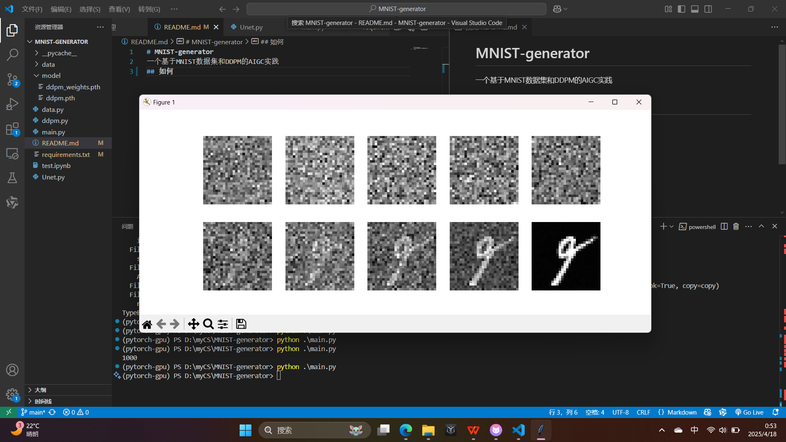

# MNIST-generator
一个基于MNIST数据集和DDPM的AIGC实践

## 介绍
该项目基于PyTorch和DDPM实现了一个基于MNIST数据集的AIGC实践。
从一个纯高斯噪声开始，逐步去噪，最终生成一个手写数字的图像。
虽然目前效果不太好，但是可以作为一个入门级的AIGC实践项目，后续可以对模型进行改进和优化，使生成的“数字”更像数字（doge）。
## 如何使用
1. 环境
```shell
conda create -n mnist-generator python==3.9
conda activate mnist-generator
```
下载依赖
```shell
pip install -r requirements.txt
```
2. 生成
```shell
python main.py
```

## 预览


## 一些想法
算法大概是这么个算法，但是项目代码属实写得一坨，后面慢慢改吧，争取把这个小项目写得好看一点。

另外，除了ddpm，我想把ddim，score matching，flow matching全部手搓一遍，并且给这个项目做一个命令行工具用来选择算法和模型。如果有时间的话再写写学习笔记什么的，把这个项目写成一个diffusion model入门实践教程一样的东西。当然我自己也才入门哈哈哈哈

再后续可能可以往模型里面加一些conditioning，比如说给模型一个数字的标签，然后生成对应的数字。这么一想还真把很多知识串起来了诶。